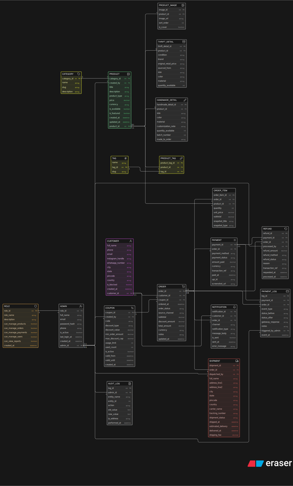

# Thrift Creator Store

A full-stack e-commerce backend designed for creators selling **thrift (second-hand)** and **handmade** products. The system supports role-based admin management, product cataloguing, order lifecycle, payment tracking, refunds, shipment, and customer notifications — all modelled in a relational database.

---

## Database Schema Diagram

---

## Overview

The schema is organized into the following functional domains:

| Domain | Tables |
|---|---|
| Admin & Access Control | `roles`, `admin`, `admin_logs` |
| Customer | `customer` |
| Catalogue | `category`, `tag`, `product`, `product_tags`, `product_images` |
| Product Details | `thrift_detail`, `handmade_detail` |
| Orders | `order`, `order_item`, `coupon` |
| Payments | `payment`, `payment_events` |
| Fulfilment | `refund`, `shipment` |
| Notifications | `notification` |

---

## Entity Descriptions

### Admin & Access Control

- **roles** — Defines permission sets for admins (manage products, orders, payments, users, view reports).
- **admin** — Store administrators linked to a role; tracks login activity and active status.
- **admin_logs** — Immutable audit trail of every admin action, capturing the before/after state, entity affected, and IP address.

### Customer

- **customer** — Registered buyers with contact info, social handles (Instagram, WhatsApp), location, and account status flags (`is_active`, `is_blocked`).

### Catalogue

- **category** — Top-level product groupings with URL-friendly slugs.
- **tag** — Flexible labels attached to products for filtering and discovery.
- **product** — Core product record with `product_type` distinguishing thrift from handmade items; includes pricing, availability, and featured flags.
- **product_tags** — Many-to-many join between products and tags.
- **product_images** — Multiple images per product with sort order and a cover-image flag.

### Product Details

- **thrift_detail** — Extended attributes for second-hand items: condition, brand, original retail price, sourcing info, size, color, material, and available stock.
- **handmade_detail** — Extended attributes for handmade items: customization notes, batch number, made-to-order flag, stock, and price override.

### Orders

- **coupon** — Discount codes with fixed or percentage discount types, usage caps, validity windows, and spend thresholds.
- **order** — Customer purchase with applied coupon, order status, source channel, and totals (subtotal, discount, total).
- **order_item** — Line items within an order capturing quantity, unit price, and a product snapshot (title + type) at time of purchase.

### Payments

- **payment** — Payment record per order with method, status, transaction reference, and UPI/screenshot fields for manual payment verification.
- **payment_events** — Append-only log of every payment status transition, gateway response, and who triggered the change.

### Fulfilment

- **refund** — Refund requests tied to an order and payment, processed by an admin, with amount, method, status, and reason.
- **shipment** — Dispatch details including full delivery address, carrier, tracking number, status, and key timestamps (shipped, estimated delivery, delivered).

### Notifications

- **notification** — Messages sent to customers via different channels (email, WhatsApp, SMS, etc.) with delivery status and error tracking.

---

## Key Design Decisions

- **Dual product types** — Products are stored in a single `product` table with a `product_type` discriminator. Type-specific attributes live in `thrift_detail` or `handmade_detail` (one-to-one with `product`), keeping the core table clean.
- **Immutable event logs** — Both `admin_logs` and `payment_events` are append-only tables, ensuring a complete and tamper-evident audit trail.
- **Order item snapshots** — `order_item` stores `snapshot_title` and `snapshot_type` so historical orders remain accurate even if the product is later edited or deleted.
- **Role-based admin permissions** — Permissions are modelled as boolean columns on the `roles` table, giving fine-grained access control without a separate permissions join table.
- **Soft deletes** — Customers and admins use `is_active` / `is_blocked` flags rather than hard deletes to preserve referential integrity across orders and logs.
